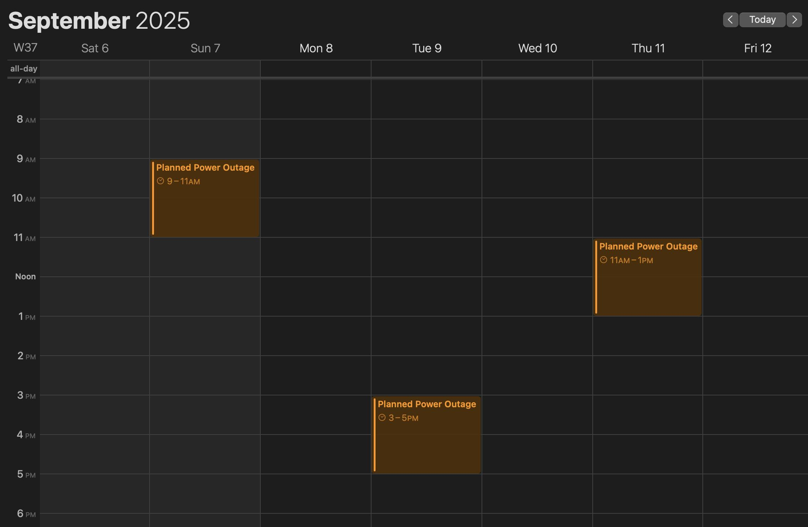

# ⚡️ Barghvim

**Barghvim** = _Bargh_ (برق / Power) + _Taqvim_ (تقویم / Calendar)

A tiny Go service that fetches planned power outages from the official API (برق من) and exposes them as an **iCalendar (.ics)** feed. Subscribe once, and see all upcoming blackouts directly in your Google, Apple, or Outlook calendar.

---

## 🚀 How it works

- Pulls planned outages for your **bill number (شناسه قبض)** using your API token
- Converts Shamsi (جلالی) dates to Gregorian
- Serves an `.ics` feed ready to import into any calendar app

---

## 📅 Result

You’ll see events like:

```
Planned Power Outage
⏰ 2025-09-07, 09:00 → 11:00
```

directly in your calendar.

---

## 🖼 Screenshots

<br>
<div align="center">
  <p>
    
  </p>
</div>

---

## 🛠 Usage

Subscribe in Google Calendar, Apple Calendar, Outlook, etc.

```
https://barghvim.vercel.app/v1/<bill_number>/cal.ics?token=<your_token>
```

Example:

```
https://barghvim.vercel.app/v1/1234567890/cal.ics?token=eyJhbGciOi...
```

- Replace `<bill_number>` with your real شناسه قبض
- Replace `<your_token>` with your برق من API token
- Token is valid \~6 months; renew and update the URL when needed

---

## 🔒 Privacy

Barghvim is **stateless**.

- No data, bill numbers, or tokens are stored anywhere.
- Everything is fetched live from the برق من API and returned as an `.ics` feed.
- Your subscription URL is private — anyone with the link can view it, so **don’t share it publicly**.

---

## 🤝 Contributing

Contributions are welcome!

1. Fork the repo
2. Create a new branch (`git checkout -b feature/your-feature`)
3. Commit changes (`git commit -m 'Add new feature'`)
4. Push to your fork (`git push origin feature/your-feature`)
5. Open a Pull Request

Issues, bug reports, and ideas are also appreciated.

---

## 🔗 Links

- Repo: [github.com/mokhajavi75/barghvim](https://github.com/mokhajavi75/barghvim)
- Live: [barghvim.vercel.app](https://barghvim.vercel.app)
