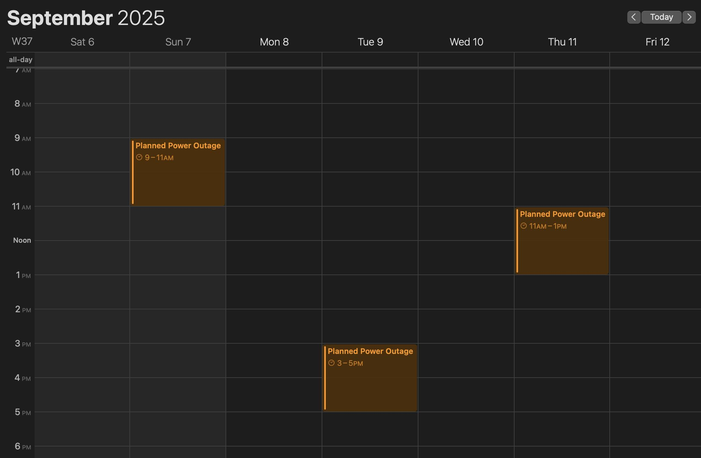

# ⚡️ Barghvim

**Barghvim** = _Bargh_ (برق / Power) + _Taqvim_ (تقویم / Calendar)

A tiny Go service that fetches planned power outages from the official Tehran outage map and exposes them as an **iCalendar (.ics)** feed. Subscribe once, and see all upcoming blackouts directly in your Google, Apple, or Outlook calendar.

All you need is your bill number. No account, no token, nothing to renew.

---

## 🚀 How it works

- Pulls planned outages for your **bill number (شناسه قبض)** from the public outage-map API
- Shows outages that are upcoming or in progress, and drops them once they are over
- Solves the upstream bot check in-process, so no browser is involved
- Converts Shamsi (جلالی) dates to Gregorian
- Caches each report and serves an `.ics` feed ready to import into any calendar app

The upstream API is only reachable from inside Iran, so Barghvim has to run somewhere with Iranian network access — a local machine or a VPS inside the country.

Upstream also caps lookups at **20 calls an hour per source IP**, counted across the whole server rather than per subscriber. Barghvim caches every report, collapses simultaneous lookups of one bill into a single call, and serves the last good copy when a refresh fails, so a polling calendar client never reaches the limit on its own.

---

## 📅 Result

You'll see events like:

```
⚡️ Planned Power Outage
⏰ 2025-09-07, 09:00 → 11:00
📍 <the address on your bill>
📝 مدیریت انرژی
```

directly in your calendar, with the reconnection estimate as the end time.

---

## 🖼 Screenshots

<br>
<div align="center">
  <p>
    
  </p>
</div>

---

## 🏃 Running it

### With Go

```bash
go run .
```

### With Docker

```bash
cp .env.example .env
docker compose up -d
```

Or without compose:

```bash
make image
docker run --rm -p 8080:8080 barghvim:dev
```

The image is a static binary on `scratch` (~16 MB) with the timezone database compiled in, running as an unprivileged uid. Most of that size is the embedded JavaScript interpreter used to answer the upstream bot check.

For deploying to a server, see [`deploy/README.md`](deploy/README.md) — CI builds and publishes an image on every `v*` tag, and the server only pulls it.

### Configuration

All configuration is environment variables — see `.env.example`.

| Variable                  | Default            | Description                                    |
| ------------------------- | ------------------ | ---------------------------------------------- |
| `ADDR`                    | `:8080`            | Listen address; wins over `PORT`               |
| `PORT`                    | —                  | Port shorthand when `ADDR` is unset            |
| `LOG_LEVEL`               | `info`             | `debug`, `info`, `warn`, or `error`            |
| `CACHE_TTL`               | `6h`               | How long a report is reused, `1m`–`168h`       |
| `UPSTREAM_CALLS_PER_HOUR` | `18`               | Upstream allowance, 1–20                       |
| `UPSTREAM_URL`            | outage-map lookup  | Override the upstream API, for testing         |

`CACHE_TTL` trades freshness for allowance. At 6 hours each subscribed bill costs four calls a day, so the 20-an-hour cap supports roughly 120 bills. Raise it if you serve many subscribers; lower it only if you serve very few.

---

## 🛠 Usage

Subscribe in Google Calendar, Apple Calendar, Outlook, etc.

```
https://<your-host>/<bill_number>.ics
```

Example:

```
https://barghvim.ir/1234567890123.ics
webcal://barghvim.ir/1234567890123.ics
```

- Replace `<bill_number>` with your real شناسه قبض, the 13-digit number on your bill
- The `.ics` suffix is optional; it only helps browsers hand the feed to a calendar app

`GET /healthz` returns `ok` for liveness checks.

---

## 🔒 Privacy

Barghvim keeps **no persistent state**.

- Nothing is written to disk — no database, no files, no logs of bill numbers.
- Outage reports are cached in memory only, and a restart refetches them.
- Request logs record the matched route only — never the bill number.
- Your subscription URL is private: a bill number is enough to see an address and an outage schedule, so **don't share it publicly**.

If you expose Barghvim beyond your own network, put it behind TLS.

---

## 🧑‍💻 Development

```bash
make check   # fmt + vet + test -race
make test    # tests only
make cover   # coverage report in the browser
make help    # list all targets
```

The project is a single flat package — `main.go` wires things up, `server.go` handles HTTP, `outages.go` talks to the upstream API, `challenge.go` solves the bot check, `cache.go` holds the report cache and the call budget, `jalali.go` converts dates, and `calendar.go` renders the feed.

---

## 🤝 Contributing

Contributions are welcome!

1. Fork the repo
2. Create a new branch (`git checkout -b feature/your-feature`)
3. Commit changes (`git commit -m 'Add new feature'`)
4. Push to your fork (`git push origin feature/your-feature`)
5. Open a Pull Request

Issues, bug reports, and ideas are also appreciated.

---

## 🔗 Links

- Repo: [github.com/mokhajavi75/barghvim](https://github.com/mokhajavi75/barghvim)
